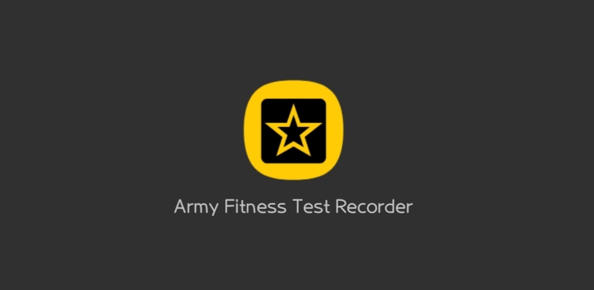
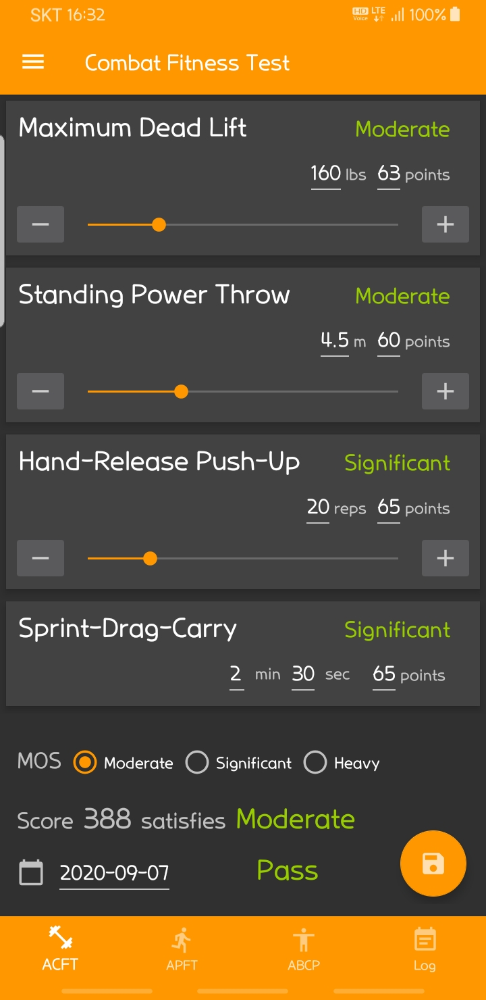

# Army Fitness Test Recorder
Army Fitness Test Recorder Application

## Overview
Army Fitness Test Recorder (This Application) has been designed based on US Army Regulation and Field Manual (AR 600–9, FM 7–22) to help out soldiers to figure out their ability. This application supports for Army Combat Fitness Test, Army Physical Fitness Test, and Army Body Composition Program.

Download in Google Play Store

## What can do with this application
- Users can easily put raw scores in typing, pressing buttons, or scrolling seek-bars.
- This application calculates and shows the user's score in real-time as the user changes the raw score for each event.
- User can store each record, and export to in forms of SQLite DB or MS-Excel.

This application has never been authorized by any official department from the US Army. The result of this application cannot be valid without the record in official form. Use for reference only.

## Licence
    Copyright (C) 2020 Army Fitness Test Recorder

    Licensed under the Apache License, Version 2.0 (the "License");
    you may not use this file except in compliance with the License.
    You may obtain a copy of the License at

          http://www.apache.org/licenses/LICENSE-2.0

    Unless required by applicable law or agreed to in writing, software
    distributed under the License is distributed on an "AS IS" BASIS,
    WITHOUT WARRANTIES OR CONDITIONS OF ANY KIND, either express or implied.
    See the License for the specific language governing permissions and
    limitations under the License.
